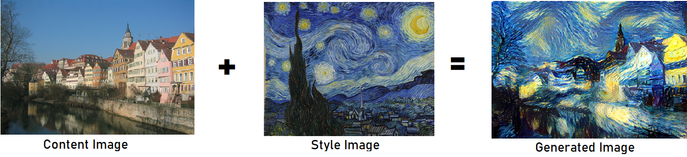

# NeuralStyleTransfer

An implementation of [NST](https://arxiv.org/abs/1508.06576) using Keras.

Neural Style Transfer (NST) is one of the most fun techniques in deep learning. As seen below, it merges two images, namely, a "content" image and a "style" image, to create a "generated" image. The generated image combines the "content" of the first image with the "style" of second one.

Keras alerady includes the ``` VGG``` model so no need to include it in another file.

# Example



# Usage

```
python main.py --content <content image path> --styles <style image path> --output <output image path>
```
You can also set interations number ```--interations``` and output width ```--width```
